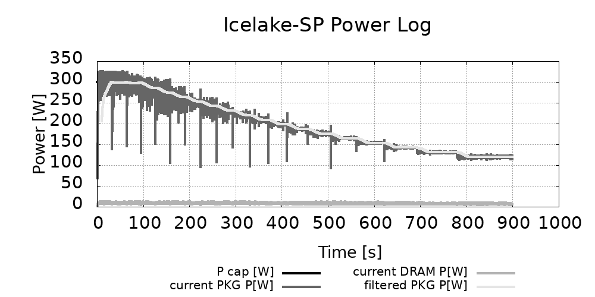
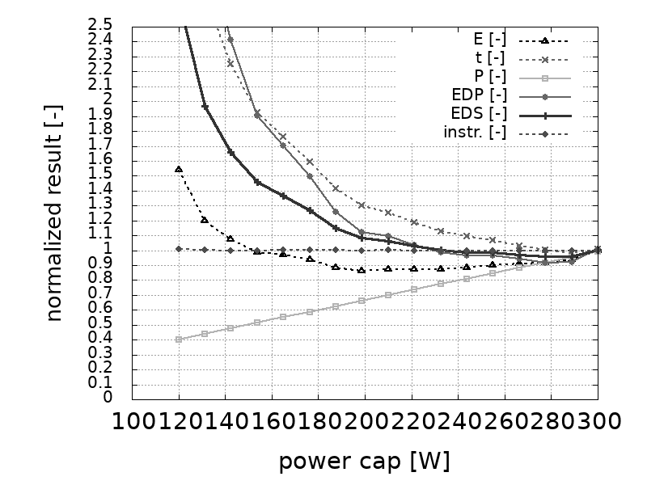
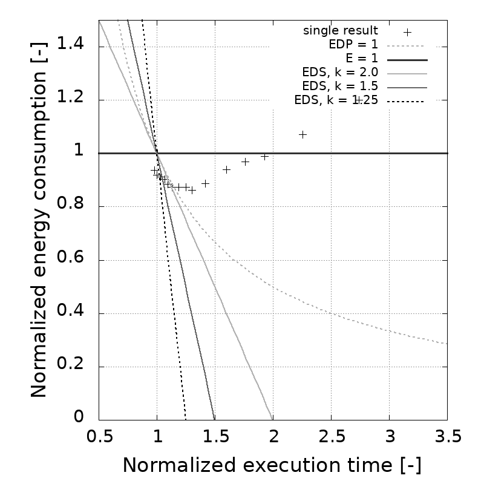
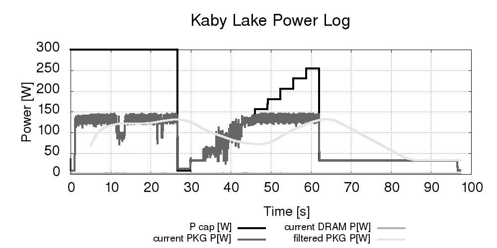

# Anotation

This is an open source work-in-progress repository collecting a set of software tools for power monitoring and controlling in HPC systems.
Some features might change in the future, some features might be removed when part of the technology used here become deprecated.

# SPLiT

Welcome to Software Power Limiting Tools repository - an open source collection of tools designed
for supporting energy-aware high-performance computing.
So far the repository supports Intel based CPUs and NVIDIA GPUs.

## The tools available at the moment:
1. Static Energy Profiler (StEP) `./build/StEP`
2. Dynamic Energy-Performance Optimizer `./build/DEPO`

### Static Energy Profiler (StEP)
This tool is designed for static exploration of the energy characteristic of the given Device.
The device types supported at the moment are:
- Intel CPU
- NVIDIA GPU

The tool is designed for automatic examination of power limits impact on energy consumption and performance
of application executed on examined device.
Basically, the tool automates the subsequent execution of the application with different power caps (limits)
and as a result produces the report of the best power cap with respect to 3 predefined target optimization metrics.
Since Intel CPUs don't have clear minimal power limit value the tool it is exploring the power limits range between
the idle consumption power limit level (measured prior to application execution) and default power cap value
(usually the same as maximal available power limit value). The power limits are examined with Linear Search method,
starting from the highest value, with decrement defined percentage-wise by the user in the `params.conf` file.

The details of the tool for CPU might be found in the paper:

>Krzywaniak, A., Czarnul, P., & Proficz, J. (2019).
>
>*Extended investigation of performance-energy trade-offs under power capping in HPC environments.*
>
>https://doi.org/10.1109/hpcs48598.2019.9188149

For GPU the power limits are explored between max and min value (which are defined by NVIDIA and available to obtain
via NVML API). The power decrement is fixed for 5W.

The details of the tool for GPU might be found in the paper:
>Krzywaniak, A., Czarnul, P., & Proficz, J. (2022).
>
>*GPU Power Capping for Energy-Performance Trade-Offs in Training of Deep Convolutional Neural Networks for Image Recognition.*
>
>https://doi.org/10.1007/978-3-031-08751-6_48


### Dynamic Energy-Performance Optimizer (DEPO)
This tool is designed for dynamic exploration and selection of the power cap according to selected target optimization metric. The tool shall be launched with the application for which the energy and performance
shall be optimized by adjusting the power cap value with respect to the selected target metric.
The tool is able to perform the search with Linear Search Algorithm or with Golden Section Search Algorithm.
The details of the tool for CPU may be found in the paper:

>Krzywaniak, A., Czarnul, P., & Proficz, J. (2022).
>
>*DEPO: A dynamic energy‐performance optimizer tool for automatic power capping for energy efficient high‐performance computing. SOFTWARE-PRACTICE & EXPERIENCE, 52, 2598-2634.*
>
>https://doi.org/10.1002/spe.3139


The details of the tool for GPU may be found in the paper:

>Adam Krzywaniak, Paweł Czarnul, Jerzy Proficz (2023)
>
> *Dynamic GPU power capping with online performance tracing for energy efficient GPU computing using DEPO tool, Future Generation Computer Systems, Volume 145, 2023, Pages 396-414, ISSN 0167-739X.*
>
>https://doi.org/10.1016/j.future.2023.03.041.


# Build and usage
It is recommended to create a build directory.
```
mkdir build
cd build
cmake ..
make
```

# Known dependencies
```
sudo apt-get update && sudo apt-get install build-essential cmake gnuplot
sudo apt-get install libboost-all-dev
```

# Exemplary usage

## StEP
`./build/StEP ./minibenchmarks/openmp/fft 16384 25`


Above command shall run exemplary FFT application with StEP for CPU and produce
as a result `cpu_experiment_*` folder with `.csv` logs and visualised `.png`
power log similar to below one:


and StEP tool results visualised as below:



## DEPO
`./build/DEPO --ls --en ./minibenchmarks/openmp/fft 1024 300`

Above command shall run exemplary FFT application with DEPO and produce
as a result `cpu_experiment_*` folder with `.csv` logs and visualised `.png`
power log similar to below one:



One may modify the execution parameters in `params.conf` file.


# Related works
If you find this code usefull please cite any of our papers which contributed to this codebase:

1. Static Energy Profiler (StEP) for CPU:

        @INPROCEEDINGS{9188149,
        author={Krzywaniak, Adam and Czarnul, Pawel and Proficz, Jerzy},
        booktitle={2019 International Conference on High Performance Computing & Simulation (HPCS)}, 
        title={Extended investigation of performance-energy trade-offs under power capping in HPC environments}, 
        year={2019},
        pages={440-447},
        doi={10.1109/HPCS48598.2019.9188149}
        }

2. Static Energy Profiler (StEP) for GPU:

        @inproceedings{10.1007/978-3-031-08751-6_48,
        author = {Krzywaniak, Adam and Czarnul, Pawel and Proficz, Jerzy},
        booktitle = {Computational Science -- ICCS 2022},
        isbn = {978-3-031-08751-6},
        pages = {667--681},
        publisher = {Springer International Publishing},
        title = {GPU Power Capping for Energy-Performance Trade-Offs in Training of Deep Convolutional Neural Networks for Image Recognition},
        year = {2022}
        }

3. Dynamic Energy-Performance Optimizer (DEPO) for CPU:

        @article{https://doi.org/10.1002/spe.3139,
        author = {Krzywaniak, Adam and Czarnul, Paweł and Proficz, Jerzy},
        title = {{DEPO}: A dynamic energy-performance optimizer tool for automatic power capping for energy efficient high-performance computing},
        journal = {Software: Practice and Experience},
        volume = {52},
        number = {12},
        pages = {2598-2634},
        keywords = {automatic power capping, green computing, HPC, performance-energy trade-off, software tools},
        doi = {https://doi.org/10.1002/spe.3139},
        year = {2022}
        }

4. Dynamic Energy-Performance Optimizer (DEPO) for GPU:

        @article{KRZYWANIAK2023396,
        author = {Adam Krzywaniak and Pawe{\l} Czarnul and Jerzy Proficz},
        doi = {https://doi.org/10.1016/j.future.2023.03.041},
        issn = {0167-739X},
        journal = {Future Generation Computer Systems},
        keywords = {Energy-aware computing, High-performance computing, Green computing, Machine learning, GPU energy optimization},
        pages = {396-414},
        title = {Dynamic GPU power capping with online performance tracing for energy efficient GPU computing using DEPO tool},
        volume = {145},
        year = {2023},
        }

