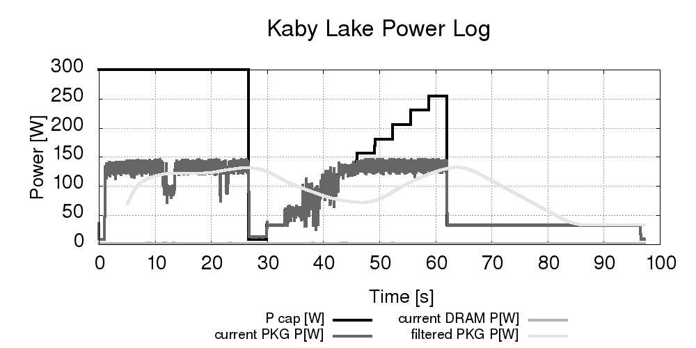

# SPLiT

Software Power Limiting Tools

# Anotation

This repository is an open source work-in-progress repository collecting a set of software tools for power monitoring and controlling in HPC systems.

# Build and usage
It is recommended to create a build directory.
```
mkdir build
cd build
cmake ..
make
```
The tools available at the moment:
- Static Energy Profiler (StEP) `./build/StEP`
- Dynamic Energy-Performance Optimizer `./build/DEPO`


# Known dependencies

Dependency added on Jan 2020:
```
sudo apt-get install libboost-all-dev
```

Since Feb 2020 project uses cmake >= v 3.10.

Dependency added on Aug 2021
```
sudo apt install libssl-dev
```

# Exemplary usage

`./build/DEPO --ls --en ./minibenchmarks/openmp/fft 1024 300`

Above command shall run exemplary FFT application with DEPO and produce
as a result `experiment_*` folder with `.csv` logs and visualised `.png`
power log similar to below one:



One may modify the execution parameters in `params.conf` file.
